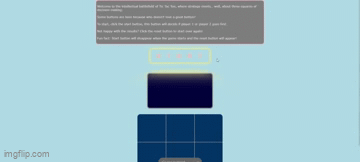

# Tic Tac Toe
Un joc que es troba a gairebé tots els menús infantils del món ja està disponible al meu github! Aquest projecte era realment només una excusa per practicar la lògica i desplegar alguna cosa a vercel. No patrocinat per vercel, però va ser molt fàcil de configurar, m'agrada molt que pugui empènyer al meu github i el meu desplegament de vercel s'actualitzarà automàticament, molt bonic, 10/10.

**Enllaç al projecte:**

    

## Com es fa:

**Tecnologia utilitzada:** HTML, CSS, JavaScript, Vercel

A partir de l'HTML i el CSS, vaig utilitzar el cos com a contenidor flexible, per donar-me tot en una columna centrada. Em sento bastant intel·ligent amb com vaig crear el tauler per al joc, al css només vaig utilitzar els identificadors que necessitava per crear una sola línia en certs quadrats, podria haver donat a cadascun d'aquests divs identificats una classe per compartir, de manera que només hauria de seleccionar la classe, però va ser més divertit a la meva manera. Els botons que vaig trobar en línia i vaig canviar alguns dels El CSS per adaptar-se a les meves necessitats. Em vaig divertir repassant el codi d'una altra persona per esbrinar què feia què i com canviar les coses sense trencar tota la configuració. Entrant en JavaScript, vaig tenir cura d'intentar etiquetar el que estava fent com ho estava fent. Em vaig adonar que fer això en realitat feia que fos molt més fàcil tornar al meu flux de treball perquè podia rastrejar on anava i per què anava per allà. Vaig fer un esforç addicional per assegurar-me que cada vegada que es feia clic a alguna cosa a la pantalla, un usuari rebria algun tipus de comentari que no és tan senzill com es pensa. També em vaig assegurar d'utilitzar colors síncrons. Hi ha funcions per iniciar i restablir el joc, fins i tot vaig incloure un petit aleatoritzador per barrejar quin jugador ha d'anar primer. L'inici i el restabliment desapareixen després de fer clic per indicar que el joc s'ha d'iniciar o reiniciar. He inclòs un valor que realment pot fer o trencar el joc. Hi ha una variable anomenada count que s'estableix com a igual a 0. Quan comença, el recompte s'afegeix aleatòriament 0 o 1, si el recompte és parell, el jugador 2 va, si el recompte és senar, el jugador 1 va. Aquesta lògica m'ajuda a fer un seguiment de quin jugador està preparat per moure's. També vaig incloure en la lògica que comprova si hi ha un guanyador o un empat, per afegir 999999 al recompte, i després estableixo una condició que si el recompte és superior a 999, els oients d'esdeveniments que activen el joc, no compliran la condició per activar-se, una meravellosa Una solució senzilla a un problema podria haver estat complicat. La següent part interessant és com configurar les funcions guanyador/empatat. Cadascun dels divs del tauler té un ID, després vaig ordenar totes les rutes possibles de guanyar ID i les vaig emmagatzemar en una matriu. Si tots els ID de qualsevol de les matrius fossin iguals a 'X' o 'O', tindríem un guanyador, si cap dels valors inclogués un '', i no hi hagués cap guanyador definit, la lògica sabria que no hi ha més quadrats buits, de manera que el joc és un empat. Aquesta comprovació del guanyador es produeix després de cada moviment del jugador.
Aquest projecte està allotjat a vercel, una manera senzilla d'allotjar i enviar actualitzacions a un projecte desplegat directament des del teu terminal!

## Optimitzacions

No hi havia pensat fins que vaig acabar amb el css, però podria haver utilitzat més variables al meu css per a un espaiat uniforme entre tot el meu contingut. Al JavaScript hi ha casos en què he utilitzat let quan podria haver utilitzat const, potser només sóc indecís amb la manera com crec que utilitzaré les meves variables. També podria haver introduït el recompte cap a la part superior del JS en lloc de cap a la part inferior només per fer-lo semblar millor.

## Lliçons apreses

Crec que una experiència subestimada que vaig tenir treballant en aquest projecte va ser passar pel codi del botó, em va agradar molt aquest procés de jugar amb el codi d'una altra persona per configurar-lo per a les meves pròpies necessitats. Tinc pràctica empenyent codis en seccions De manera que cada desplegament és una introducció de noves funcions i correccions d'errors d'un desplegament anterior, va fer que el meu flux de treball se senti professional. Quan vaig aprendre per primera vegada sobre els bucles no vaig veure com serien útils en producció, però aquest projecte em va donar una Una visió molt necessària de la seva ajuda. Poder utilitzar un forEach per afegir un oient d'esdeveniments a cada div en lloc d'afegir-ne un a cadascun manualment va ser increïble!